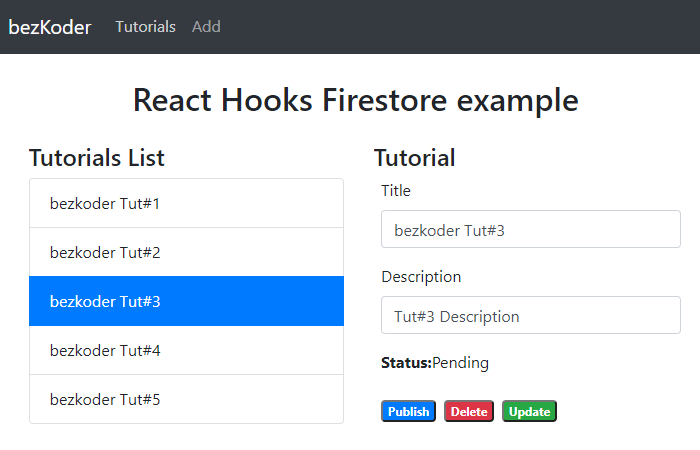

# React Hooks Firestore: CRUD App with Firebase Cloud Firestore

We're gonna build an React Firestore App using [firebase](https://www.npmjs.com/package/firebase) library in which:
- Each Tutorial has id, title, description, published status.
- We can create, retrieve, update, delete Tutorials (CRUD operations) from Firebase Cloud Firestore



For instruction, please visit:
> [React Hooks Firestore example: Build a CRUD app](https://bezkoder.com/react-hooks-firestore/)

More practice:
> [React Firebase Hooks: CRUD App with Realtime Database example](https://bezkoder.com/react-firebase-hooks-crud/)

> [React (Hooks) CRUD example to consume Web API](https://bezkoder.com/react-hooks-crud-axios-api/)

> [React Pagination using Hooks example](https://bezkoder.com/react-pagination-hooks/)

> [React Hooks File Upload example](https://bezkoder.com/react-hooks-file-upload/)

> [React Hooks: JWT Authentication & Authorization example](https://bezkoder.com/react-hooks-jwt-auth/)

> [React + Redux + Hooks: JWT Authentication & Authorization example](https://bezkoder.com/react-hooks-redux-login-registration-example/)

Fullstack with Node.js Express:
> [React.js + Node.js Express + MySQL](https://bezkoder.com/react-node-express-mysql/)

> [React.js + Node.js Express + PostgreSQL](https://bezkoder.com/react-node-express-postgresql/)

> [React.js + Node.js Express + MongoDB](https://bezkoder.com/react-node-express-mongodb-mern-stack/)

Fullstack with Spring Boot:
> [React.js + Spring Boot + MySQL](https://bezkoder.com/react-spring-boot-crud/)

> [React.js + Spring Boot + PostgreSQL](https://bezkoder.com/spring-boot-react-postgresql/)

> [React.js + Spring Boot + MongoDB](https://bezkoder.com/react-spring-boot-mongodb/)

Fullstack with Django:

> [React.js Hooks + Django Rest Framework](https://bezkoder.com/django-react-hooks/)


This project was bootstrapped with [Create React App](https://github.com/facebook/create-react-app).

## Project setup

In the project directory, you can run:

```
npm install
# or
yarn install
```

or

### Compiles and hot-reloads for development

```
npm start
# or
yarn start
```

Open [http://localhost:3000](http://localhost:3000) to view it in the browser.

The page will reload if you make edits.
